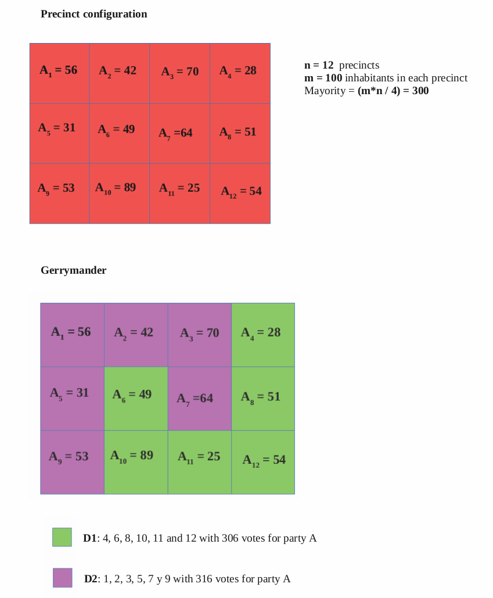

# Gerrymandering
An implementation of the [Gerrymandering Algorithm](https://en.wikipedia.org/wiki/Gerrymandering) using Dynamic-programming techniques


## Input format 
The configuration of the precincts must be written in a text file with the following structure:
- Number of precincts, n. (Line 1)
- Popullation of each precinct, m. (Line 2)
- Votes to party A in each of the n precincts, n integer values separated by spaces. (Line 3) 
- Adjacencies matrix, an n x n matrix. Each row of the matrix must be written in a new line.
  Each column must be separated by one space. The position [i][j] will be a 1 if the precinct i is 
  adjacent to precint j, or a 0 if precinct i is NOT adjacent to precinct j.

In the folder [input/](./input/), there are two input examples. Below, you can see the configuration of each example and the generated Gerrymander.

### Example 01


### Example 02




## Execution 
In order to try the algorithm you will need to install Java on your computer. Once you have installed Jave, set the *src* directory as your current directory and execute the following command:

```
java Main 
```

You will be asked for an input text file. You can provide one of the given examples specifying its relative route:

```
************** GERRYMANDER **************

> File route: input/example01.txt 

```
